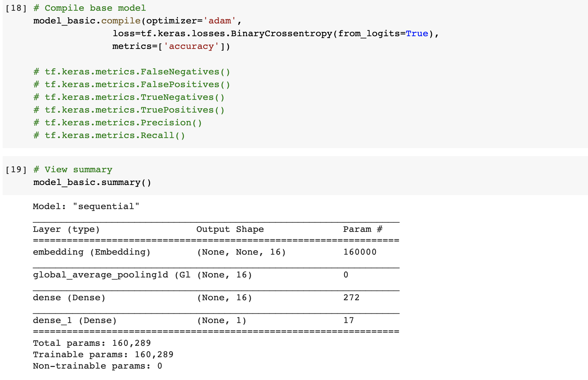
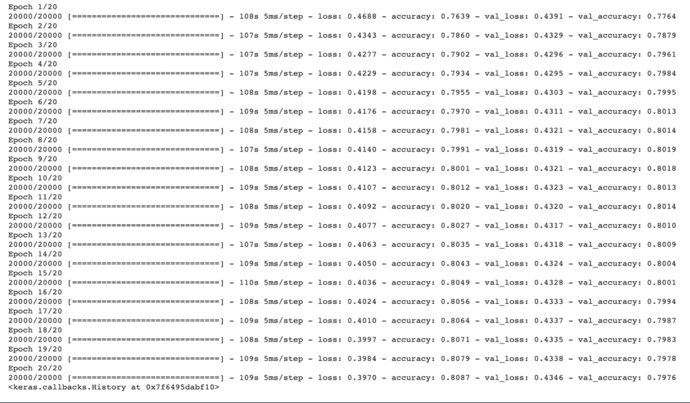
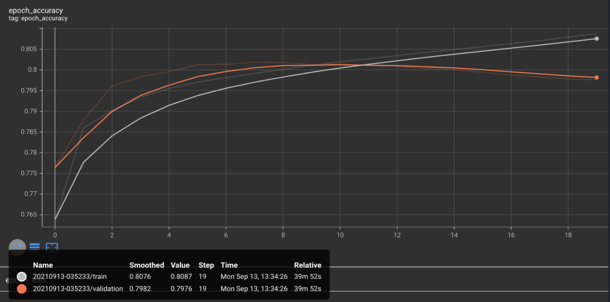
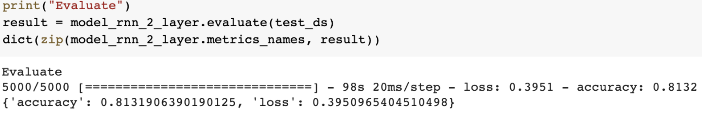
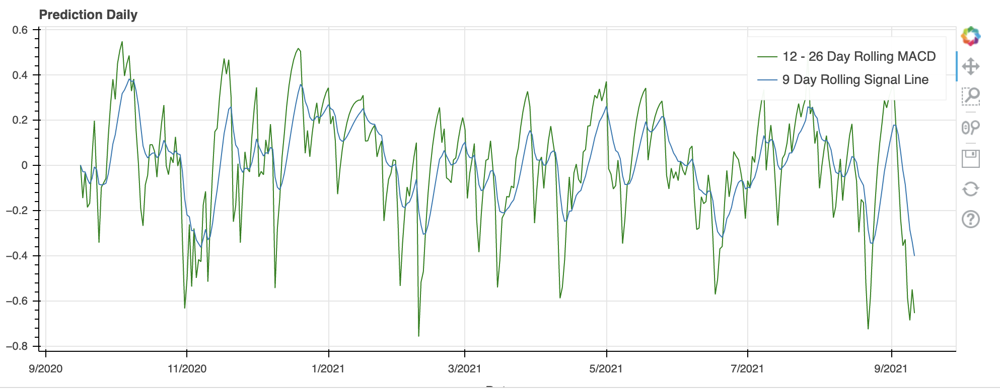

<head>
  <base href="">
</head>

<p align="center">
 
</p>

<p>&nbsp;</p>

## **Table of Contents**

[Disclaimer](https://github.com/Best-Brain-Gang/twitter_sentiment_analysis#disclaimer)

[Project Overview](https://github.com/Best-Brain-Gang/twitter_sentiment_analysis#project-overview)

[Technologies](https://github.com/Best-Brain-Gang/twitter_sentiment_analysis#technologies)

[Installation Guide](https://github.com/Best-Brain-Gang/twitter_sentiment_analysis#installation-guide)

[Models](https://github.com/Best-Brain-Gang/twitter_sentiment_analysis#models)

[Examples](https://github.com/Best-Brain-Gang/twitter_sentiment_analysis#examples)

[Usages](https://github.com/Best-Brain-Gang/twitter_sentiment_analysis#usages)

[Contributors](https://github.com/Best-Brain-Gang/twitter_sentiment_analysis#contributors)

[Presentation Deck](https://github.com/Best-Brain-Gang/twitter_sentiment_analysis#deck)

[License](https://github.com/Best-Brain-Gang/twitter_sentiment_analysis#license)


---

## **Disclaimer**

The content contained in this project iPython notebook is for informational purposes only. You should not construe any such information or other material (the “Materials”) as investment, financial, tax, legal or other advice. The Materials are not investment advice and any observations concerning any security, trading algorithm or investment strategy provided in the project is not a recommendation to buy, sell or hold such investment or security or to make any other investment decisions. The contributors in this project do not provide any advice regarding the nature, potential value, risk or suitability of any particular investment strategy, trading algorithm, transaction, security or investment. Any use of the Materials, and any decisions made in reliance thereon, including any trading or investment decisions or strategies, are made at your own risk. You should seek the advice of a competent, licensed professional if you require investment, trading or other advice. The contributors of this project is not authorized to provide any professional advice in connection with this project and any such advice. Nothing contained in the Materials constitutes a solicitation, recommendation, endorsement, or any third party service provider to buy or sell any securities or other financial instruments in this or in any other jurisdiction whether or not such solicitation or offer would be unlawful under the securities laws of such jurisdiction.

---


# **Twitter Sentiment Analysis**

## **Project Overview**
With the use of NLP Sentiment Analysis, we will analyze the tweets regarding Activision Blizzard and correlate the tweets (or news) to the historical S&P 500 stock price and Activision Blizzard (ATVI) and how it affects it, then score those tweets as good, bad, or neutral. That tool is then used to compare the tweet activity to rise or fall of SP500 and ATVI as a whole. We rovide recommendation using a deep learning model to predict future performance


---
## **Technologies**

This project leverages **[python version 3.8.5](https://www.python.org/downloads/)** with the following packages and modules:

* [pandas](https://pandas.pydata.org/docs/) - This was used to be able to easily manipulate dataframes.

* [Scikit Learn](https://scikit-learn.org/stable/) - *version 0.24.2* - This package has a lot of different tools and model that could be use to create a machine learning model.

    * [linear model](https://scikit-learn.org/stable/modules/linear_model.html) - This allows the model to call the Logisitic Regression model to run our machine learning.


* [Numpy](https://numpy.org/) - This provides the ability to work with arrays and use different mathematical calculations on arrays.

* [TensorFlow](https://www.tensorflow.org/) - *version 2.6.0* - This is an end-to-end open source platform for machine learning. It has a comprehensive, flexible ecosystem of tools, libraries, and community resources that lets researchers push the state-of-the-art in ML and developers easily build and deploy ML-powered applications.

    * [Bidirectional LSTM](https://www.tensorflow.org/api_docs/python/tf/keras/layers/Bidirectional)

* [Keras](https://keras.io/) - *version 2.6.0* - This is an API designed for human beings, not machines. Keras follows best practices for reducing cognitive load: it offers consistent & simple APIs, it minimizes the number of user actions required for common use cases, and it provides clear & actionable error messages. It also has a free open source Python library for developing and evaluating deep learning models.

     * [models Sequential](https://keras.io/guides/sequential_model/) - This is used appropriately for a plain stack of layers where each layer has exactly one input tensor and one output tensor.
  
     * [ReLU](https://keras.io/api/layers/activations/) - The rectified linear unit (ReLU) function returns a value from 0 to infinity. This activation function transforms any negative input to 0. It is the most commonly used activation function in neural networks due to its faster learning and simplified output. However, it is not always appropriate for simpler models.

     * [Recurrent Neural Network (RNN)](https://www.tensorflow.org/guide/keras/rnn) - This is a class of neural networks that is powerful for modeling sequence data such as time series or natural language.

* [ALPACA Trade API](https://alpaca.markets/docs/) -  This is used to get API trading data for this project. To have access to Alpaca's API key and API secret keys, the user needs to register for personal account and save their own keys.

* [OS module](https://docs.python.org/3/library/os.html) - This provides a portable way of using operating system dependent functionality.

* [python-dotenv Library](https://pypi.org/project/python-dotenv/) - This enables the user to read key-value pairs from an .env file and set them as an environment variables.

* [Twint](https://github.com/twintproject/twint) -  It is an advanced Twitter scraping tool written in Python that allows for scraping Tweets from Twitter profiles without using Twitter's API. utilizes Twitter's search operators to let you scrape Tweets from specific users, scrape Tweets relating to certain topics, hashtags & trends, or sort out sensitive information from Tweets like e-mail and phone numbers.
---

## **Installation Guide**


### 1. Running Google Colaboratory

On your web browser (use incognito),  copy and paste this link below: 

https://colab.research.google.com/notebooks/intro.ipynb?utm_source=scs-index#recent=true

After pulling the ipynb file from github and saving it on your local machine or Google Drive, this link should've a pop-up allowing you to upload your ipynb file.

### 2. Installing the libraries needed for this iPython Notebook

 Since we are using Google Colaboratory, we are installing each our libraries while on the platform. This will allow the user to temporarily use the libraries while on the cloud. As you can see on gif below, it shows you that the installs are run, it will run during your Colab session.

The libraries that we will be installing are the following:

- To Install Twint: 
    
    `!pip3 install --user --upgrade git+https://github.com/twintproject/twint.git@origin/master#egg=twint` 

    *Note: Twint sometimes fails to load even after installing it on the notebook, so best way to get it to work is to restart the runtime and refresh the Google Colab.*

- To install Alpaca API: 

    `!pip install alpaca-trade-api`

- To install python dotenv: 

    `!pip3 install python-dotenv`


---

## **Machine Learning Models**

- Base - Sequential model
- Recurrent Neural Network (RNN) - Bidirectional LSTM (BiLSTM)
- Recurrent Neural Network 2 (RNN 2)- Bidirectional LSTM (BiLSTM)

---

## **Examples**

Base Model Summary


Base Model Epoch


Base Model Accuracy


RNN2 Model


Prediction Graph



---


## **Usages**

After installing the libraries, we have to import the libraries below:

### 1. Importing the libraries below as part of the ipynb:

`import os`

`import re`

`import io`

`import string`

`import datetime`

`import numpy as np`

`import twint`

`import nest_asyncio`

`import pandas as pd`

`import tensorflow as tf`

`from sklearn.model_selection import train_test_split`

`from tensorflow import keras`

`from bokeh.plotting import figure, show`

`from bokeh.io import output_notebook`

`from tensorflow.keras import Sequential`

`from tensorflow.keras.layers import Dense, Embedding, GlobalAveragePooling1D`

`from tensorflow.keras.layers.experimental.preprocessing import TextVectorization`

`from keras.backend import manual_variable_initialization`

`from dotenv import load_dotenv, find_dotenv`

`import alpaca_trade_api as tradeapi`

### 2. Then continue to run the other sections, then when the user gets to Download Data, click on the link, copy and paste the code and enter.

### 3. Once running each model, when the user gets to Tensorboard, which sometimes does not show, please use incognito browser in this case. Also, the RNN and RNN2 models both take awhile to load their epochs.


---

## **Contributors**

### UW FinTech Bootcamp

#### Colin Benjamin [](https://www.linkedin.com/in/colinbenjamin/) &nbsp;&nbsp;&nbsp;| &nbsp;&nbsp;&nbsp; Justine Cho [](https://www.linkedin.com/in/justinecho) &nbsp;&nbsp;&nbsp;| &nbsp;&nbsp;&nbsp; Christopher Henderson [](https://www.linkedin.com/in/chris-henderson123/) &nbsp;&nbsp;&nbsp;| &nbsp;&nbsp;&nbsp; Nathan Patterson [](https://www.linkedin.com/in/natepatterson/) 


---

## **Deck**

```Click [HERE](./Resources/Images/Twitter_Sentiment_and_ATVI_stock_price.pdf) to learn more from our presentation.```

```[](./Resources/Images/Twitter_Sentiment_and_ATVI_stock_price.pdf) ```

---

## **License**

### MIT License

Copyright (c) [2021] [UW Fintech Bootcamp: Colin Benjamin | Justine Cho | Chris Henderson | Nathan Patterson]

Permission is hereby granted, free of charge, to any person obtaining a copy
of this software and associated documentation files (the "Software"), to deal
in the Software without restriction, including without limitation the rights
to use, copy, modify, merge, publish, distribute, sublicense, and/or sell
copies of the Software, and to permit persons to whom the Software is
furnished to do so, subject to the following conditions:

The above copyright notice and this permission notice shall be included in all
copies or substantial portions of the Software.

THE SOFTWARE IS PROVIDED "AS IS", WITHOUT WARRANTY OF ANY KIND, EXPRESS OR
IMPLIED, INCLUDING BUT NOT LIMITED TO THE WARRANTIES OF MERCHANTABILITY,
FITNESS FOR A PARTICULAR PURPOSE AND NONINFRINGEMENT. IN NO EVENT SHALL THE
AUTHORS OR COPYRIGHT HOLDERS BE LIABLE FOR ANY CLAIM, DAMAGES OR OTHER
LIABILITY, WHETHER IN AN ACTION OF CONTRACT, TORT OR OTHERWISE, ARISING FROM,
OUT OF OR IN CONNECTION WITH THE SOFTWARE OR THE USE OR OTHER DEALINGS IN THE
SOFTWARE.
